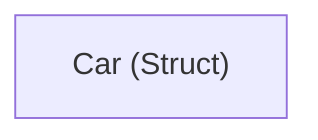
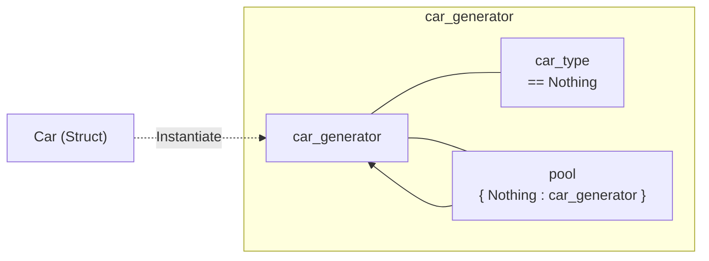
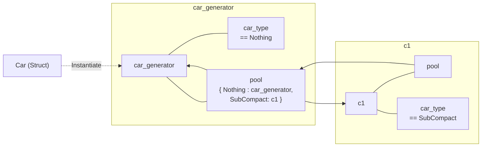
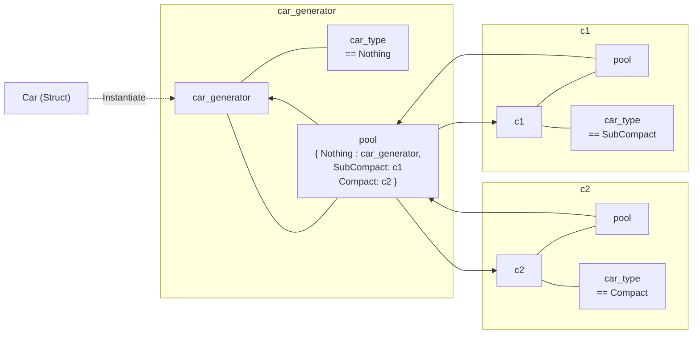
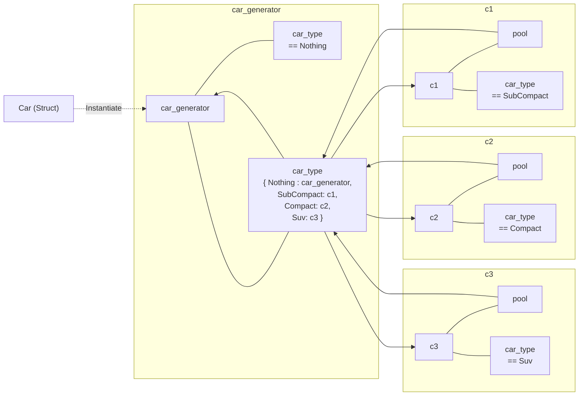
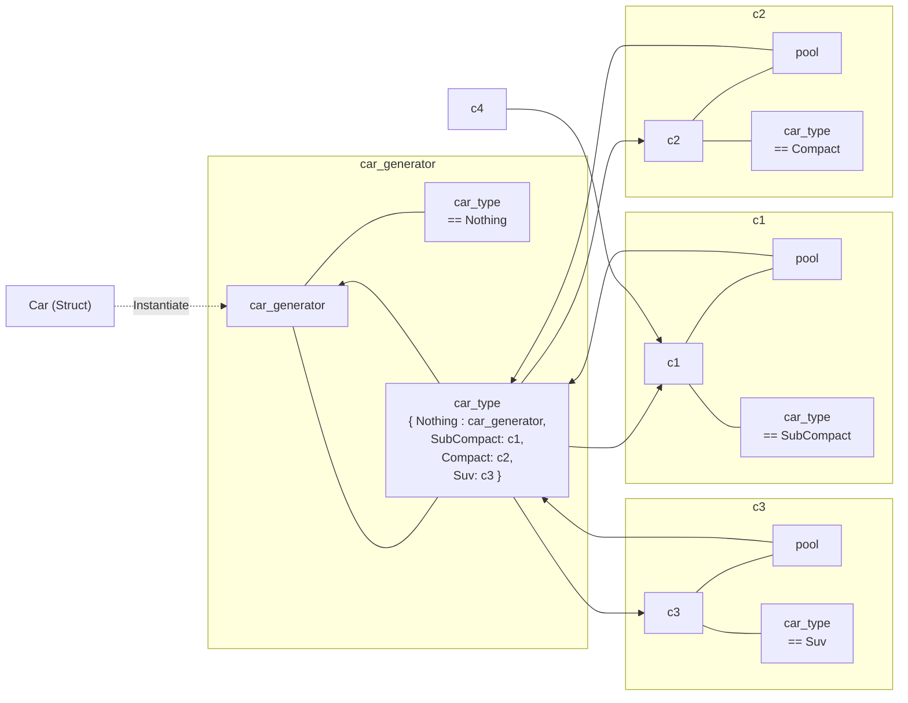
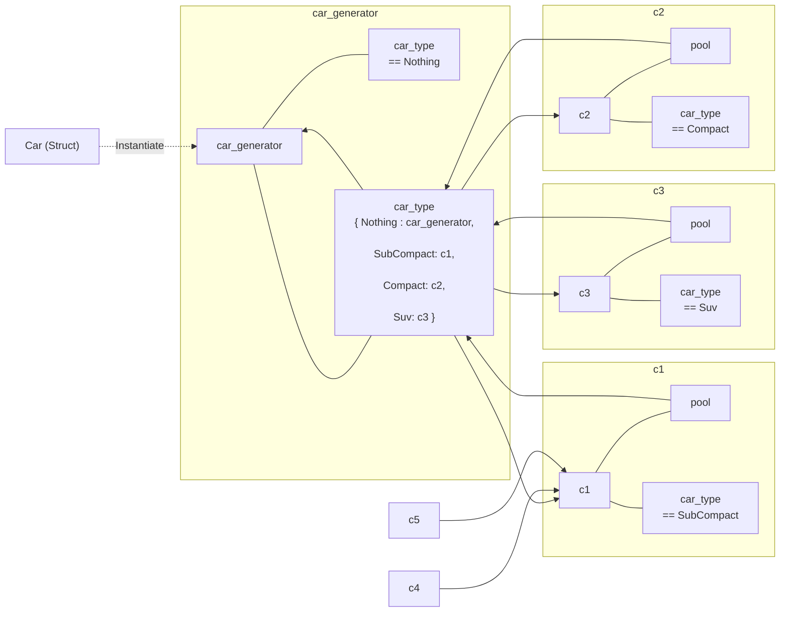
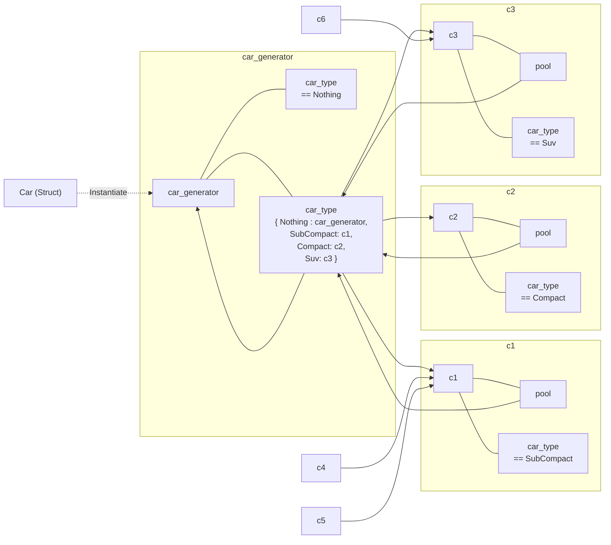

# Flyweight in Rust

This material shows how instances are generated in Rust.


## 1

This is before the code is executed.



## 2

```rust
let car_generator = Car::init();
```




## 3

```rust
for _ in 0..10 {
    let c1 = car_generator.new(CarType::SubCompact);
    c1.render(
        color_generator(),
        rng.gen_range(min_point, max_point),
        rng.gen_range(min_point, max_point)
    );
    car_counter += 1;
}
```




## 4

```rust
for _ in 0..3 {
    let c2 = car_generator.new(CarType::Compact);
    c2.render(
        color_generator(),
        rng.gen_range(min_point, max_point),
        rng.gen_range(min_point, max_point)
    );
    car_counter += 1;
}
```




## 5

```rust
for _ in 0..5 {
    let c3 = car_generator.new(CarType::Suv);
    c3.render(
        color_generator(),
        rng.gen_range(min_point, max_point),
        rng.gen_range(min_point, max_point)
    );
    car_counter += 1;
}
```




## 6

```rust
let c4 = car_generator.new(CarType::SubCompact);
```




## 7

```rust
let c5 = car_generator.new(CarType::SubCompact);
```




## 8

```rust
let c6 = car_generator.new(CarType::Suv);
```

